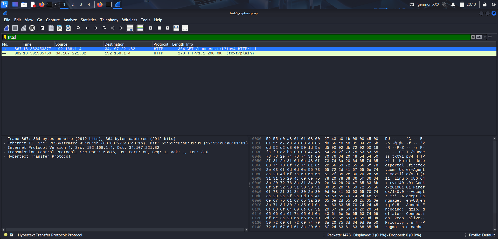

# 🧠 Task 5 – Network Traffic Capture & Analysis using Wireshark

## 🎯 Objective
Capture live network packets using **Wireshark** and analyze traffic patterns, key protocols, and communication behavior to build hands-on cybersecurity and networking skills.

---

## 🛠 Tools & Environment
- **Operating System:** Kali Linux  
- **Tool Used:** Wireshark  
- **Packet Analyzer Script:** Custom `analyze_pcap.py` (Python + Scapy)  
- **Output Report:** `report.txt`  

---

## 📁 Files in This Repository
| File | Description |
|------|--------------|
| `task5_capture.pcap` | Original Wireshark capture file |
| `report.txt` | Detailed analysis report generated using `analyze_pcap.py` |
| `Screenshots/` | Step-by-step evidence of the capture and analysis |
| `README.md` | Documentation and summary (this file) |

---

## ⚙️ Capture Methodology
1. **Started Wireshark** on the active interface (`wlan0`).  
2. **Generated network activity** by browsing websites, pinging domains, and performing DNS lookups.  
3. **Captured traffic** for approximately one minute.  
4. **Applied filters** for various protocols like `tcp`, `udp`, and `dns`.  
5. **Exported the capture** to `task5_capture.pcap` for further offline analysis.  
6. **Ran** a Python analysis script to generate protocol and IP statistics.

---

## 📊 Analysis Results (From `report.txt`)

### **Capture Overview**
| Metric | Value |
|--------|--------|
| **Total Packets Captured** | 1,473 |
| **Unique Protocols** | 1 (`Ether`) |
| **Unique Source IPs** | 20 |
| **Unique Destination IPs** | 20 |
| **Unique Destination Ports** | 81 |

---

### **Top Source IPs**
| Source IP | Packets |
|------------|----------|
| 192.168.1.4 | 601 |
| 172.217.26.4 | 238 |
| 142.250.182.234 | 80 |
| 216.58.196.110 | 67 |
| 10.74.188.229 | 62 |

---

### **Top Destination IPs**
| Destination IP | Packets |
|----------------|----------|
| 192.168.1.4 | 863 |
| 172.217.26.4 | 105 |
| 10.74.188.229 | 62 |
| 216.58.196.110 | 60 |
| 151.101.157.91 | 55 |

---

### **Top Destination Ports**
| Port | Packets | Protocol |
|------|----------|-----------|
| 443 | 528 | HTTPS (Secure Web Traffic) |
| 49163 | 228 | Dynamic/Private Port |
| 53 | 62 | DNS (Domain Name System) |
| 38458 | 47 | Dynamic/Private Port |
| 47950 | 43 | Dynamic/Private Port |

---

## 🔍 Observations
- The majority of packets are **Ethernet frames**, representing encrypted HTTPS traffic (Port 443).  
- **192.168.1.4** (local host) communicated heavily with **Google servers** (`172.217.x.x`, `142.250.x.x`).  
- Presence of **DNS traffic (Port 53)** confirms hostname resolution activity.  
- Ports like `49163`, `38458`, and `47950` represent **ephemeral ports** used for temporary client connections.  
- All communication appears **normal** — no suspicious or abnormal patterns identified.

---

## 🧾 Outcome
✅ Successfully captured and analyzed live network packets.  
✅ Identified source/destination hosts, ports, and protocol types.  
✅ Learned how encrypted traffic dominates modern browsing (HTTPS).  
✅ Enhanced understanding of packet structures and IP-based communication.

---

## 📸 Included Screenshots
- Wireshark interface and interface selection
  
  
- Live packet capture in progress
  

- Applied protocol filters
  
  
- Packet detail views and protocol analysis
  
 
- Command-line execution of analysis script
  
  
- Generated `report.txt` output  
  
---

## 📚 Key Learnings
- Practical exposure to **Wireshark packet analysis**
- Understanding of **protocol layers (Ethernet → IP → TCP/UDP)**
- Identifying **top IPs and ports** in network communication
- Importance of **encryption and HTTPS** in secure browsing

---

## 🏁 Conclusion
This project demonstrates the ability to perform **end-to-end network traffic capture and analysis** using industry-standard tools.  
It highlights how packet inspection can help understand **real-time communication, identify traffic patterns, and ensure network integrity**.

---
### **Author**
- **Cybersecurity Intern – Task 5** 
- Your Name : DHANUSH S 
- Date: 27 Oct 2025
